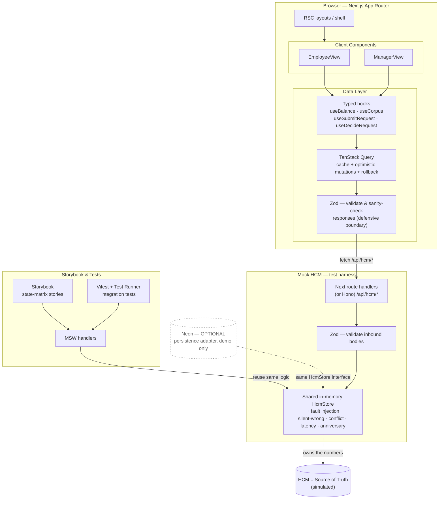
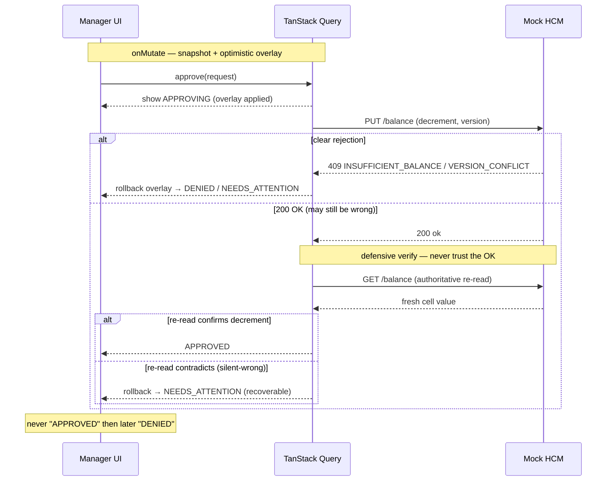
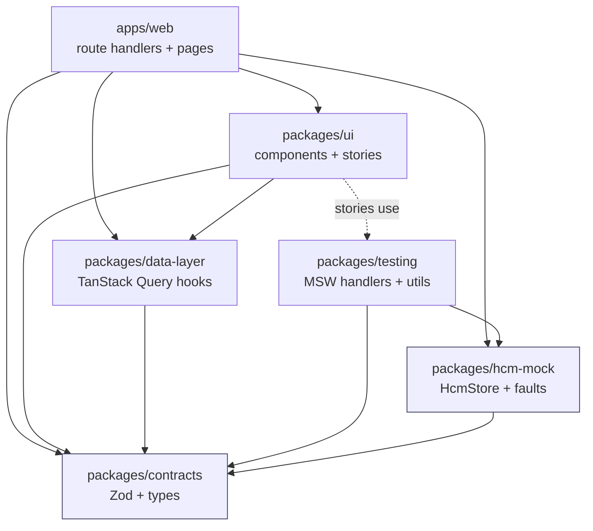

# ExampleHR — Time-Off Frontend

**Agent build brief.** This document is the single source of truth for building the ExampleHR Time-Off frontend with an agentic workflow (e.g. Claude Code). It captures every requirement from the take-home assignment, then layers on a recommended technical approach, API contracts, data models, a full UI state matrix, a test strategy, and a phased build plan.

> **How to read this doc.** Sections marked **[REQUIRED]** come straight from the assignment and must be satisfied. Sections marked **[RECOMMENDED]** are proposed defaults with rationale — strong starting points you can adopt or revise. Because the TRD is graded on *your reasoning*, treat the recommended choices as a baseline to defend or argue against, not gospel.

---

## 1. Context & Problem [REQUIRED]

ExampleHR has a module that is the primary interface for employees to request time off. The **HCM system** (Workday / SAP class of product) remains the **Source of Truth** for all employment and balance data. ExampleHR's frontend must present balances and request workflows that feel **instant and trustworthy**, even though the underlying numbers are owned by a system ExampleHR does not control.

**The core tension:** showing balances that are both *fast* and *correct* is hard when truth lives elsewhere.

- If an employee sees "10 days available" and requests 2, the UI needs instant feedback — but the HCM may reject the request.
- The displayed balance may already be **stale** (e.g. HCM granted a work-anniversary bonus 30 seconds ago).
- The frontend must resolve this gracefully **without confusing the user or the approving manager**.

**Hard constraint:** an employee must **never** be told "approved" and then later "actually, denied." Any late-arriving contradiction must be **recoverable** in the UX.

---

## 2. Personas & Their Needs [REQUIRED]

| Persona | Needs | Key UX guarantee |
|---|---|---|
| **Employee** | See an accurate balance; get instant feedback on submit. | Never shown a false-positive outcome ("approved" → later "denied"). |
| **Manager** | Approve/deny with confidence the balance is valid **at the moment of approval**, not minutes ago. | Balance context shown at decision time must reflect a fresh authoritative read. |

---

## 3. What to Build [REQUIRED]

1. **Employee view** — see balances **per-location** and submit time-off requests.
2. **Manager view** — review and approve/deny pending requests, with **balance context visible at decision time**.
3. **Data layer** — talks to mock HCM endpoints, handles optimistic updates, reconciles with the source of truth, and degrades gracefully when HCM is slow, wrong, or silent.
4. **Mock HCM endpoints** — Next.js route handlers (or MSW handlers) with enough logic to simulate: real-time read/write, the batch corpus endpoint, a work-anniversary bonus on a timer/trigger, occasional silent failures, and occasional conflict responses.
5. **Storybook stories for every meaningful UI state** — Storybook is the proof you've thought through the states, not just the happy path.

---

## 4. The Interesting Challenges [REQUIRED]

These are the cases the system is graded against. Each one needs an explicit, defensible strategy in the TRD.

1. **External mutation.** ExampleHR is not the only writer. On work anniversaries or at year start, balances refresh underneath a user who already has the app open. The UI must reconcile **without surprising** them.
2. **Authoritative per-cell read.** HCM exposes a real-time API for reading/writing a **single** balance (e.g. "1 day for `locationId=X, employeeId=Y`"). Treat it as the authoritative per-cell read.
3. **Batch corpus read.** HCM also exposes a batch endpoint returning the **full corpus** of balances across all dimensions. Useful for initial hydration and periodic reconciliation, but **expensive** — use sparingly.
4. **Unreliable success.** HCM *usually* returns a clear error on an invalid dimension combination or insufficient balance — **but not always**. Be defensive: **assume a success response can still be wrong**, and design the UX so a late-arriving contradiction is recoverable.
5. **Multi-row balances.** Balances are **per-employee, per-location**. A single employee may have several rows.

---

## 5. Recommended Tech Stack [RECOMMENDED]

| Concern | Choice | Why (rationale for the TRD) |
|---|---|---|
| Framework | **Next.js (App Router)** | [REQUIRED]. Route handlers double as the mock HCM. |
| Server-state / data fetching | **TanStack Query (React Query)** | Purpose-built for "source of truth lives elsewhere": stale-while-revalidate, background refetch, query invalidation, and first-class **optimistic mutations with rollback** (`onMutate` / `onError` / `onSettled`). It models this exact problem better than hand-rolled fetching or a generic store. |
| Client/UI state | **Zustand** (small) or local React state | For cross-component UI concerns not owned by the server (selected location, drawer open, toast queue). Keep server truth in React Query; keep ephemeral UI in Zustand/local state. Don't duplicate server state into a store. |
| Network mocking / harness | **MSW** + **Next route handlers** | MSW intercepts at the network layer so the *same* mock HCM logic drives Storybook, tests, and the running app. Route handlers give a real runnable server for the deployed Storybook/app. Share the core in-memory HCM logic between both. |
| Component dev + state proof | **Storybook** | [REQUIRED]. Hosts the state matrix and interaction tests. |
| Test runner | **Vitest** + **@testing-library/react** | Fast, ESM-native, integrates with Storybook's test runner. |
| Integration tests | **Storybook Test Runner** (Playwright-backed) + **MSW** | Drives the real components against the mock HCM across the full fault matrix. |
| Language | **TypeScript** | Contracts below are typed; types are the cheapest regression guard. |
| **Validation / contracts** | **Zod** | Strong fit. Validate the HCM request/response **shapes** *and* sanity-check **values** at the boundary — this is the concrete mechanism behind "assume a success response can still be wrong" (§4). Also drives `RequestForm` validation. Derive TS types from schemas (`z.infer`) so one source defines runtime + compile-time contracts. |
| Deploy | **Vercel** (app + Storybook) or `npm run storybook` single command | [REQUIRED]: deployed or trivially runnable locally. |

### On the proposed stack (Next + Neon + Zod + Hono)

- **Zod — yes, keep it.** It's the best addition. It's the literal tool for defensive parsing of an untrustworthy source of truth.
- **Hono — optional, marginal.** Hono-on-Next (via its Next adapter) gives nicer routing/middleware/validation than bare route handlers, and that's defensible. But for ~4 mock endpoints it can read as over-engineering, and it does **not** remove the need for MSW (Storybook renders in the browser with no backend, so MSW is mandatory regardless). If you adopt Hono, the rule that actually matters is unchanged: put the HCM behavior in **one shared core module** and let *both* the Hono/route handlers and the MSW handlers call it. Framework choice is the shell, not the substance.
- **Neon (Postgres) — I'd push back for this assignment.** A real DB doesn't help where the grading is:
  - **Storybook can't reach Postgres** — the graded "proof of states" artifact runs in-browser and must be driven by MSW/in-memory mocks anyway, so Neon adds zero there.
  - **Determinism suffers.** The whole point of the mock HCM is *deterministically* pinning faults per scenario (silent-wrong, conflict, latency, anniversary). An in-memory store resets cleanly between tests/stories; a shared DB needs teardown/seeding and invites flaky, order-dependent tests.
  - **"Single command to run" gets harder** — connection strings, migrations, and a live DB cut against the deliverable's "trivially runnable locally."
  - **Signals misplaced effort.** This is explicitly a *frontend* take-home; the value is "TRD precision + test design," not backend persistence.
  - **When Neon *would* make sense:** only as an *optional* persistence adapter behind the same `HcmStore` interface (so tests still use in-memory), purely to show a richer live demo. Treat it as a stretch, not the core — and even then, keep MSW + in-memory as the test/Storybook path.

**Bottom line:** Next.js App Router + TanStack Query + **Zod** + MSW + in-memory HCM core is the tightest fit. Add Hono if you like its ergonomics. Hold Neon unless you specifically want to demo persistence, and keep it off the test path if you do.

---

## 5.5 Architecture Diagrams [RECOMMENDED]

### System architecture



The single most important structural decision is the dashed **"reuse same logic"** edge: the live app hits the route handlers and Storybook/tests hit MSW, but **both resolve to one `HcmStore` core**, so behavior never diverges between the demo and the proof-of-states.

### Optimistic write + verify (manager approval — the hardest path)



If a background corpus refetch lands *during* this sequence, the fresh base numbers update underneath while the optimistic overlay is re-applied on top — the in-flight action is never clobbered (see §7).

> These are Mermaid fenced blocks; they render automatically on GitHub and in most Markdown viewers. Keep them in the repo `README`/TRD so reviewers see the architecture without running anything.

---

## 5.6 Monorepo Layout [RECOMMENDED]

**Tooling:** **pnpm workspaces + Turborepo**. pnpm gives strict, content-addressed workspace linking; Turborepo gives cached, dependency-aware `build` / `lint` / `test` task pipelines. Both are the de-facto standard and trivial to justify in the TRD.

**Why a monorepo here (not just ceremony):** the single most important architectural rule in this project is *"the live app and the test harness must resolve to one HCM behavior."* In a single package that's a convention you hope nobody breaks. As a monorepo it's a **dependency edge the build enforces** — `apps/web` route handlers and `packages/testing` MSW handlers both import `packages/hcm-mock`; there is no second copy to drift. The package boundaries also map 1:1 onto the graded concerns (contracts, mock behavior, data logic, UI states), which makes the component-tree-to-concerns story in the TRD almost write itself.

> Honest tradeoff: a monorepo is more scaffolding than a take-home strictly needs. It's worth it *only because* the shared-core constraint is real here. Keep the package count disciplined — every package below earns its place by being consumed by ≥2 others or by isolating a distinct concern.

```text
exemplehr-timeoff/
├── apps/
│   └── web/                      # Next.js App Router app
│       ├── app/                  #   employee + manager routes (RSC shell + client views)
│       └── app/api/hcm/*         #   route handlers → import @repo/hcm-mock
├── packages/
│   ├── contracts/                # Zod schemas + z.infer types — the ONE contract source
│   ├── hcm-mock/                 # HcmStore core + fault injection (the substance)
│   ├── data-layer/               # TanStack Query hooks (useBalance, useSubmitRequest, …)
│   ├── ui/                       # presentational components + their Storybook stories
│   ├── testing/                  # MSW handlers (wrap hcm-mock) + shared test utils/fixtures
│   └── config/                   # shared tsconfig, eslint, vitest presets
├── pnpm-workspace.yaml
├── turbo.json
├── package.json
└── CLAUDE.md                     # agent guardrails (see companion file)
```

**Package dependency graph** (arrows = "depends on"; everything ultimately bottoms out at `contracts` + `hcm-mock`):



The two highlighted core packages are the only ones with no internal dependents-of-their-own beyond `contracts`, and they are the ones reused by both runtime paths — which is exactly the property that prevents demo/test drift.

**Workspace rules (enforce in `CLAUDE.md` + lint):**
- Cross-package imports go through the package's public entry (`@repo/<name>`), never deep `../../packages/...` paths.
- `contracts` imports nothing from the workspace (it's the root); everyone may import it.
- Only `apps/web` (route handlers) and `packages/testing` (MSW) may import `hcm-mock`. UI/data-layer talk to it **over the network**, never directly — that keeps the "source of truth is remote" boundary honest.
- Stories live next to their components in `packages/ui`; MSW decorators come from `packages/testing`.

---

## 6. Optimistic vs. Pessimistic — the Central Decision [RECOMMENDED]

This is the crux of the assignment and the heart of the TRD. The recommended posture is **hybrid, scoped by what is being claimed**:

**Be optimistic about reflecting the user's own *intent*; be pessimistic about asserting an *outcome*.**

- **Employee submit (low risk):** optimistically show the request as **`PENDING`** instantly, and optimistically show the balance as `available − pendingHold` (e.g. "8 available · 2 pending"). This is honest — it reflects an intent, not a granted decrement. If the submit itself fails, roll back the pending row.
- **Manager approve (high risk — this is the real HCM write):** the decrement against HCM is the risky write. Two acceptable patterns; pick one and defend it:
  - **(a) Confirmed-write:** show a transient `APPROVING…` state; only flip to `APPROVED` after HCM confirms. Slightly slower but never reverses a stated outcome.
  - **(b) Optimistic-with-guard:** optimistically show `APPROVED`, but immediately **re-read the authoritative per-cell value** to verify. If HCM contradicts (silent-wrong or async conflict), roll back to `NEEDS_ATTENTION` with a clear recoverable message — never silently.
- **Never** present a *final positive outcome* you cannot defend on re-read. The "approved → denied" failure is the one explicit prohibition.

**Defensive verification ("trust nothing"):** because a `200 OK` can still be wrong (Challenge 4), every state-changing write is followed by an authoritative **per-cell re-read**. A contradiction triggers reconciliation + a recoverable UI affordance, not a hard error.

---

## 7. Cache Invalidation & Reconciliation Strategy [RECOMMENDED]

| Mechanism | Source | Cadence | Purpose |
|---|---|---|---|
| Hydration | Batch corpus | Once on load | Cheap-to-render initial picture of all rows. |
| Per-cell read | Real-time single-cell | On focus, on demand, and after every write | Authoritative truth for one `(employee, location)` cell. |
| Periodic reconciliation | Batch corpus | Slow timer (e.g. every 2–5 min) or on window refocus | Catches external mutations (anniversary, year start) without hammering the expensive endpoint. |
| Post-write verify | Per-cell read | Immediately after each write | Detects silent-wrong responses. |
| Staleness marker | derived from `staleTime` | continuous | Drives the "stale" UI badge when data ages past threshold. |

**Query key design (React Query):**
```
['balances']                                  // corpus
['balance', employeeId, locationId]           // authoritative cell
['requests', { role, employeeId }]            // ExampleHR request entities
```

**Reconciling a background refresh with an in-flight user action — the tricky case:**
- Keep optimistic overlays as **derived state layered on top of server cache**, not baked into it. When a background corpus refetch lands mid-mutation, the fresh server numbers update underneath while the optimistic `pendingHold` overlay is re-applied on top — the user's in-flight action is never clobbered.
- React Query's mutation lifecycle is the seam: `onMutate` snapshots + applies the overlay; a concurrent refetch updates base data; `onSettled` invalidates and re-reads; `onError` rolls back the overlay only.
- If an external refresh *increases* a balance the user is mid-request against, the request stays valid and the UI shows the higher number — surprise-free. If it *decreases* below the requested amount, surface a non-blocking "balance changed since you opened this" notice rather than silently failing later.

---

## 8. Request Lifecycle & Ownership [RECOMMENDED]

HCM owns **balance numbers**. The **request workflow** (pending → approved/denied) is ExampleHR's domain. Model requests as ExampleHR entities (mock ExampleHR store or client state); only the **decrement on approval** is written to HCM.

```
DRAFT → SUBMITTED(PENDING) → [manager] → APPROVING → APPROVED
                                       ↘            ↘ (HCM rejects/contradicts)
                                        DENIED        NEEDS_ATTENTION → (recover: retry / re-read / cancel)
```

State enum: `PENDING | APPROVING | APPROVED | DENIED | NEEDS_ATTENTION | ROLLED_BACK`.

---

## 9. Data Models / Contracts [RECOMMENDED]

```ts
// A single authoritative balance cell.
interface Balance {
  employeeId: string;
  locationId: string;
  policy: string;          // e.g. "PTO", "SICK"
  available: number;       // days, owned by HCM
  asOf: string;            // ISO timestamp HCM stamped this read
  version: number;         // optimistic-concurrency token from HCM
}

// ExampleHR-owned request entity.
interface TimeOffRequest {
  id: string;
  employeeId: string;
  locationId: string;
  policy: string;
  days: number;
  status: 'PENDING' | 'APPROVING' | 'APPROVED' | 'DENIED' | 'NEEDS_ATTENTION' | 'ROLLED_BACK';
  submittedAt: string;
  decidedAt?: string;
  // balance snapshot shown to the manager at decision time
  balanceContext?: { available: number; asOf: string };
}

// HCM write result — note success may still be wrong.
interface HcmWriteResult {
  ok: boolean;
  conflict?: 'INSUFFICIENT_BALANCE' | 'INVALID_DIMENSION' | 'VERSION_CONFLICT';
  balance?: Balance;       // present on ok; verify against a fresh per-cell read anyway
}
```

---

## 10. Mock HCM Endpoints [REQUIRED]

Build these as Next.js App Router route handlers, with the **same in-memory logic** reused by MSW handlers so Storybook/tests and the live app share behavior. Back them with a simple in-memory store keyed by `` `${employeeId}:${locationId}:${policy}` `` plus a `version` per cell.

| Method & Path | Purpose | Behavior / fault injection |
|---|---|---|
| `GET /api/hcm/balance?employeeId&locationId&policy` | **Authoritative per-cell read.** | Returns one `Balance` with fresh `asOf` + `version`. Optional `?latency=ms`. |
| `PUT /api/hcm/balance` | **Single-cell write** (decrement on approval). | Body `{ employeeId, locationId, policy, delta, version }`. May return `INSUFFICIENT_BALANCE`, `INVALID_DIMENSION`, `VERSION_CONFLICT`. Honors fault flags below. |
| `GET /api/hcm/balances` | **Batch corpus** — all rows, all dimensions. | Expensive: add artificial latency. Used for hydration + periodic reconciliation. |
| `POST /api/hcm/trigger/anniversary` | Fire a **work-anniversary bonus**. | Bumps a target cell's `available`; also runnable on an internal timer to refresh "underneath" an open session. |
| (control) `POST /api/hcm/_fault` or `?fault=` params | **Fault injection** for the matrix. | `silent-wrong` (returns `ok:true` but does NOT actually mutate / returns stale value), `conflict` (force a rejection), `slow` (latency), `silent-failure` (drop/no-op while claiming success). |

**Required simulated behaviors (assignment-mandated):** real-time read/write, batch corpus, anniversary bonus on timer/trigger, **occasional silent failures**, **occasional insufficient-balance / conflict responses**. Make faults toggleable per-scenario so each Storybook story can deterministically pin one behavior.

---

## 11. Component Tree [RECOMMENDED]

Map the component tree to the concerns above so the TRD's "component tree maps to these concerns" requirement is satisfied.

```
<App>                              // QueryClientProvider, MSW boot, toast host
├── <EmployeeView>
│   ├── <BalanceList>              // per-location rows (multi-row aware)
│   │   └── <BalanceCard>          // available, pendingHold, stale badge, asOf
│   ├── <RequestForm>              // optimistic submit → PENDING
│   └── <RequestList>              // employee's own requests + live status
└── <ManagerView>
    ├── <PendingRequestList>
    │   └── <RequestReviewCard>    // shows FRESH per-cell balance context at decision time
    │       ├── approve → APPROVING → confirmed/guarded write
    │       └── deny    → DENIED
    └── <ReconciliationBanner>     // surfaces external-mutation / contradiction notices
```

Each leaf that touches HCM owns no fetching itself — it consumes typed hooks (`useBalance`, `useCorpus`, `useSubmitRequest`, `useDecideRequest`) so the data/reconciliation logic is centralized and testable.

---

## 12. UI State Matrix → Storybook [REQUIRED]

Every state below needs at least one story; the hard ones also get an **interaction (play) test**. This matrix is the deliverable's proof of rigor.

| State | What it shows | Story | Interaction test |
|---|---|---|---|
| **loading** | Skeletons while hydrating from corpus | ✅ | – |
| **empty** | Employee/location with zero balance rows | ✅ | – |
| **stale** | Data older than `staleTime`; stale badge + "refreshing" | ✅ | ✅ |
| **optimistic-pending** | Submit reflected instantly as PENDING + pendingHold | ✅ | ✅ assert instant update before network resolves |
| **optimistic-rolled-back** | Submit/approve fails → overlay rolled back, no false outcome | ✅ | ✅ assert rollback + recoverable message |
| **HCM-rejected** | Insufficient balance / conflict surfaced clearly | ✅ | ✅ |
| **HCM-silently-wrong** | `200 OK` but post-write re-read contradicts → NEEDS_ATTENTION | ✅ | ✅ assert verify-read catches it; no "approved" claim |
| **balance-refreshed-mid-session** | Anniversary bonus lands while a request is in-flight | ✅ | ✅ assert overlay re-applied, no clobber, no surprise |
| **manager decision context** | Fresh authoritative balance shown at approval time | ✅ | ✅ assert read happens at open, not stale |

---

## 13. Test Strategy [REQUIRED]

Make a **deliberate choice about what each test type guards**, and defend it in the TRD. Recommended split:

- **Integration tests against the mock HCM (highest value).** Guard the *reconciliation and optimistic/rollback logic* — the parts future contributors can silently break. Cover: post-write verify catches silent-wrong; background refresh doesn't clobber in-flight overlay; insufficient-balance rollback; version-conflict handling. These exercise the data layer through real hooks + MSW.
- **Storybook interaction (play) tests.** Guard *user-visible state transitions* for every row in the matrix above — the proof that each designed state actually renders and behaves.
- **Component / unit tests (Vitest + Testing Library).** Guard *presentational + pure logic* in isolation: balance math (`available − pendingHold`), staleness derivation, status reducers, formatting.
- **Type checks.** The cheapest regression guard; CI fails on `tsc` errors.

**Coverage proof:** wire `vitest --coverage` and the Storybook test runner into a single `npm test` (or CI job) and include the report. The stated goal: *a system future contributors cannot silently break.*

---

## 13.5 Integration Test Scenarios [RECOMMENDED]

### Tooling (be explicit in the TRD)

- **Integration tests (the list below): Vitest + `@testing-library/react` (`renderHook` / `render`) + MSW, where MSW is backed by the *same* `@repo/hcm-mock` core.** This is the highest-value layer: it exercises the real data-layer hooks end-to-end against a fault-injectable fake HCM, in jsdom, with no real network. We assert on what the hook/cache exposes (status, displayed balance, request state) — not on implementation details.
- **Interaction tests (state matrix): Storybook Test Runner (Playwright-backed)** — drives each story's `play` function in a real browser.
- **Unit tests: Vitest** — pure functions only.

Why this split: the reconciliation/optimistic logic is timing-sensitive and the easiest thing to silently break, so it gets the most rigorous, fastest-feedback layer (Vitest + MSW). Visual states get browser-level interaction tests. Pure math gets cheap unit tests.

### The scenarios (each = one disaster from the safeguards list)

Each pins a specific fault in `hcm-mock` so it's deterministic. `Given / When / Then` style.

| # | Guards against | Given | When | Then |
|---|---|---|---|---|
| IT-1 | **Lying success** (silent-wrong) | HCM set to `silent-wrong` (returns `200 OK` but doesn't mutate) | a write is issued, then the verify per-cell read runs | the request resolves to `NEEDS_ATTENTION`, **never** `APPROVED`; a recoverable message is exposed |
| IT-2 | **Vanishing request** (mid-flight refresh) | a submit is in flight (overlay applied) | a background corpus refetch returns a *higher* balance (anniversary bonus) before the write settles | base balance updates to the new value **and** the pending overlay is still present (not clobbered) |
| IT-3 | **Insufficient balance** | HCM holds fewer days than requested | a write is issued and HCM rejects with `INSUFFICIENT_BALANCE` | overlay rolls back to the prior snapshot; displayed balance is restored; a clear reason is surfaced |
| IT-4 | **Double-spend / conflict** | two writes target the same cell; first one lands | the second write is issued with a now-stale `version` | HCM returns `VERSION_CONFLICT`; the second request lands in `NEEDS_ATTENTION`, balance never goes negative |
| IT-5 | **Stale-at-decision** | the manager view was opened, then the cell changed underneath | the manager opens/approves a request | a fresh per-cell read fires at decision time and the decision uses the new value, not the stale one |
| IT-6 | **Silent drift** (external mutation) | app idle with a cached balance | a `trigger/anniversary` fires, then reconciliation runs (timer / refocus) | the cached cell updates without a user action and is flagged fresh; no stale value lingers past the cadence |
| IT-7 | **Happy-path write integrity** | normal HCM, sufficient balance | submit → approve → verify | request reaches `APPROVED` and the per-cell verify confirms the decrement actually happened |
| IT-8 | **Slow / silent HCM** | HCM set to high `latency` (or no response) | a read or write is issued | the hook exposes a loading/degraded state within budget and the rest of the cache stays usable (no crash, no infinite spin) |
| IT-9 | **Optimistic instant feedback** | normal HCM | a submit is issued | the pending overlay is observable **before** the network resolves (assert on the intermediate state, not just the final one) |
| IT-10 | **Corpus vs per-cell consistency** | corpus hydrated, then one cell written + invalidated | re-read that cell | the surgically-invalidated cell shows the new value while untouched cells are not refetched |

### Notes for the agent
- Use MSW handlers from `@repo/testing` that wrap `@repo/hcm-mock`; flip faults per test via the store's fault switches (don't fork the handler logic).
- For timing races (IT-2, IT-9), control resolution order explicitly (e.g. deferred promises / fake timers) so the test is deterministic, not flaky.
- Assert on observable hook output and rendered text, never on internal query-cache keys directly.
- Each scenario above should also have a matching Storybook story (§12) — the integration test proves the *logic*, the story proves the *render*.

---

## 13.6 How to test the hard cases — concrete patterns [RECOMMENDED]

Naming scenarios is not enough. Three of the integration tests (IT-2, IT-1, IT-5) involve timing or ordering that becomes flaky without explicit control. These are the patterns that make them deterministic.

### Pattern A — Deferred MSW response (controls race order)
Use for: **IT-2** (bonus arrives mid-submit), **IT-9** (assert instant feedback before network).
Hold the network response open with a promise so you can inject concurrent events (a corpus refetch, a fault flip) before resolving. This makes the race order *explicit* rather than timing-dependent.

```ts
// In your test:
let resolvePost: () => void
server.use(
  http.post('/api/hcm/requests', async () => {
    await new Promise<void>(r => { resolvePost = r })
    return HttpResponse.json({ id: 'r1', status: 'PENDING' })
  })
)

// Fire the submit — onMutate runs synchronously before any network
act(() => result.current.submitRequest({ days: 2, locationId: 'A' }))

// Overlay already applied — assert before network resolves
expect(screen.getByText('2 pending')).toBeInTheDocument()  // IT-9 ✓

// Inject the bonus mid-flight (IT-2): base 8 → 13
hcmStore.setBalance('maya', 'A', 13)
await act(() => queryClient.invalidateQueries({ queryKey: ['balances'] }))

// Overlay must survive the fresh base
expect(screen.getByText('11 available')).toBeInTheDocument()
expect(screen.getByText('2 pending')).toBeInTheDocument()  // IT-2 ✓

// Let the POST land
act(() => resolvePost())
await waitFor(() => expect(screen.getByText('PENDING')).toBeInTheDocument())
```

### Pattern B — Fault injection + never-APPROVED assertion (IT-1)
For silent-wrong: the fault is flipped on the `hcmStore` before the action. The critical assertion is that `APPROVED` *never appeared in the DOM*, not just that `NEEDS_ATTENTION` shows at the end. Use a MutationObserver or a render-history spy to catch any intermediate `APPROVED` flash.

```ts
hcmStore.setFault('maya:A', 'silent-wrong') // write returns 200 OK but doesn't mutate

const appearedTexts: string[] = []
const observer = new MutationObserver(() => {
  appearedTexts.push(document.body.innerText)
})
observer.observe(document.body, { childList: true, subtree: true })

act(() => result.current.decideRequest({ id: 'r1', decision: 'approve' }))

// APPROVING is fine — wait for it
await waitFor(() => expect(screen.getByText('APPROVING')).toBeInTheDocument())

// Verify GET fires and catches the lie → NEEDS_ATTENTION
await waitFor(() => expect(screen.getByText('NEEDS_ATTENTION')).toBeInTheDocument())

observer.disconnect()

// APPROVED must never have appeared at any point in the DOM history
expect(appearedTexts.some(t => t.includes('APPROVED'))).toBe(false)  // IT-1 ✓
```

### Pattern C — Cache pre-seed + fresh-read assertion (IT-5)
For stale-at-decision: pre-populate the cache with an outdated value, set the real store to a different value, render the decision card, and assert the component fires a fresh GET that wins over the stale cache.

```ts
// Stale cache says 8 — real store says 5 (changed externally)
queryClient.setQueryData(
  ['balance', 'maya', 'A'],
  { available: 8, asOf: subMinutes(new Date(), 20).toISOString() }
)
hcmStore.setBalance('maya', 'A', 5)

render(<RequestReviewCard request={pendingRequest} />, { wrapper: Providers })

// Fresh per-cell GET must fire and override stale cache
await waitFor(() => expect(screen.getByText('5 days available')).toBeInTheDocument())
expect(screen.queryByText('8 days')).not.toBeInTheDocument()  // IT-5 ✓
```

### General rules for all integration tests
- **Reset faults after each test** in `afterEach`: `hcmStore.clearFaults()` — don't let fault state leak between tests.
- **Isolate the query cache**: create a fresh `QueryClient` per test (`new QueryClient({ defaultOptions: { queries: { retry: false } } })`). Shared cache state across tests causes mysterious failures.
- **Never assert on `APPROVED` alone** for IT-1 — always pair it with `queryByText('APPROVED') toBe null` to guard against intermediate flashes.
- **Use `waitFor` with a timeout budget** (e.g. 2000ms) — the verify re-read in IT-1 involves two sequential network calls; the default 1000ms can be too tight on slow CI.

---

## 14. Deliverables Checklist [REQUIRED]

- [ ] **TRD** — challenges, proposed solution, alternatives considered. Must include reasoning on: optimistic vs pessimistic, cache-invalidation strategy, reconciling a background refresh with an in-flight action, and how the component tree maps to these concerns.
- [ ] **Code** in a GitHub repository.
- [ ] **Test cases + proof of coverage.**
- [ ] **Running Storybook** — deployed (Chromatic/Vercel) or runnable with a single command.
- [ ] Mock HCM endpoints with the full fault matrix.

---

## 15. Build Plan for the Agent [RECOMMENDED]

Hand these phases to the agent in order; each ends in a runnable, testable checkpoint.

1. **Scaffold the monorepo.** pnpm workspaces + Turborepo with the package layout in §5.6. `apps/web` (Next.js App Router + TS), and empty `packages/{contracts,hcm-mock,data-layer,ui,testing,config}`. Storybook in `packages/ui`, Vitest wired via `packages/config`. Turbo pipeline so `pnpm test` / `pnpm storybook` / `pnpm build` run across the graph. Checkpoint: all tasks green on empty packages.
2. **Contracts + Mock HCM core.** `packages/contracts` (Zod schemas + `z.infer` types) first, then `packages/hcm-mock` (in-memory `HcmStore` + the four endpoints' logic + fault-injection switches). Expose it through `apps/web` route handlers AND `packages/testing` MSW handlers — both importing the *same* `hcm-mock`. Checkpoint: one fault matrix, two transports, zero duplicated logic.
3. **Data layer.** Typed hooks: `useCorpus`, `useBalance`, `useSubmitRequest`, `useDecideRequest`. Implement optimistic overlays, post-write verify, rollback, and the reconciliation seam.
4. **Employee view.** BalanceList/Card + RequestForm + RequestList wired to hooks.
5. **Manager view.** PendingRequestList + RequestReviewCard with fresh-at-decision-time read + ReconciliationBanner.
6. **Storybook state matrix.** A story per row in §12, faults pinned per story.
7. **Tests.** Integration (reconciliation/optimistic), interaction (matrix), unit (logic). Coverage report.
8. **Deploy / single-command run.** Vercel or documented one-liner. Fill in the TRD.

---

## 16. Open Decisions to Resolve in the TRD

- Manager approval: **confirmed-write (a)** vs **optimistic-with-guard (b)** from §6 — pick and justify.
- Request entities: client-only state vs a small mock ExampleHR backend.
- Periodic reconciliation cadence + `staleTime` thresholds (trade freshness vs corpus cost).
- Conflict resolution policy when external refresh lowers a balance below an in-flight request.
- Whether the anniversary bonus runs on a real timer (more realistic, flakier tests) vs trigger-only (deterministic) — recommend trigger-only in tests, timer optional in the live demo.

---

### TRD Skeleton (fill this in)

```
1. Overview & goals
2. Challenges (the five from §4, restated)
3. Proposed solution
   3.1 Optimistic vs pessimistic — decision & rationale
   3.2 Data layer & query design
   3.3 Cache invalidation & reconciliation
   3.4 Reconciling background refresh with in-flight actions
   3.5 Component tree → concerns mapping
4. Mock HCM design & fault matrix
5. Test strategy — what each test type guards & why
6. Alternatives considered (and rejected)
7. Risks & open questions
8. How to run / deploy
```
