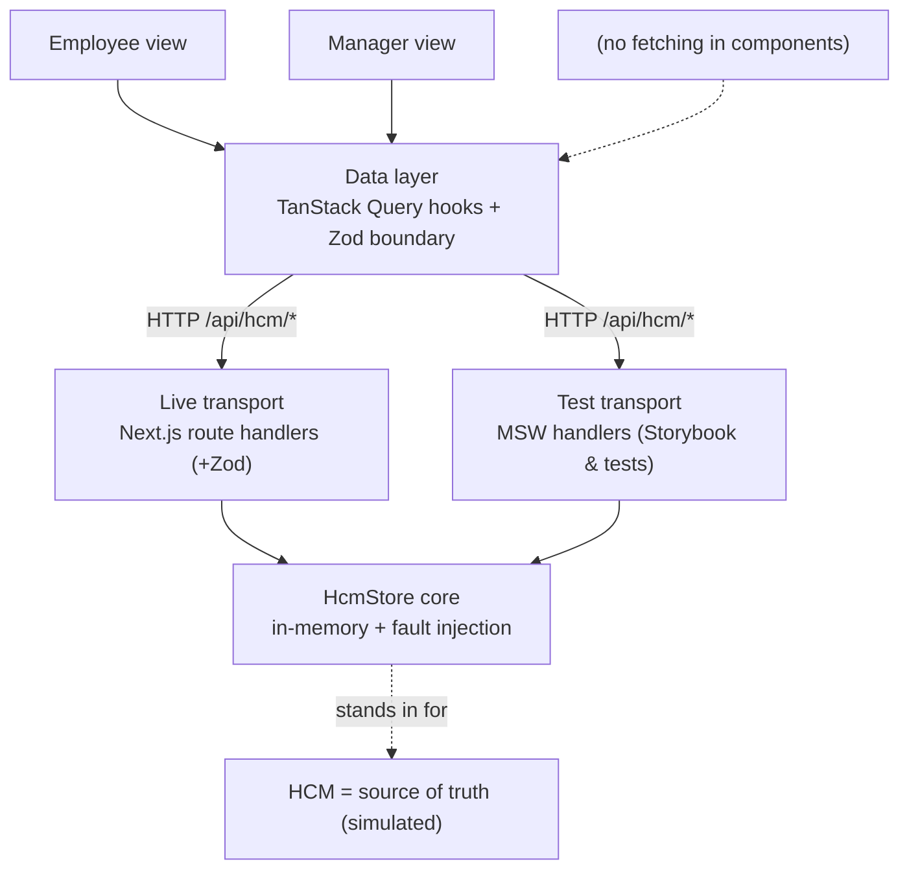
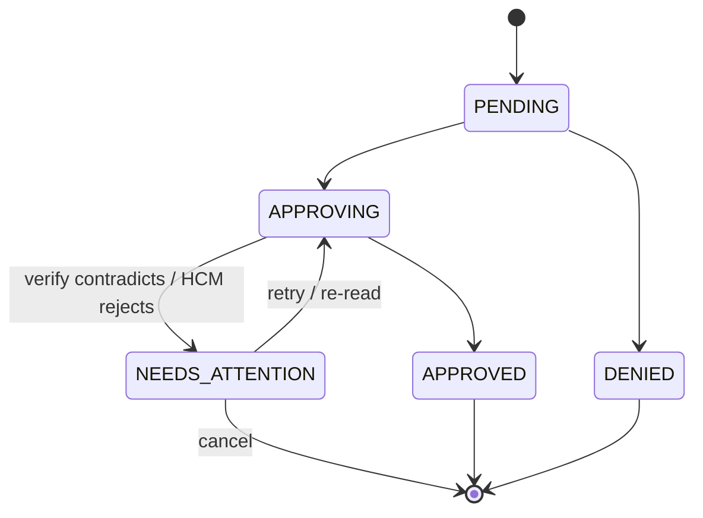

# Technical Requirements Document — ExampleHR Time-Off Frontend

**Author:** Saad Ahmed
**Status:** Proposed
**Scope:** Frontend, data layer, mock HCM harness, and test strategy for the ExampleHR time-off module.

---

## TL;DR — the one idea this whole system is built around

ExampleHR does not own the numbers it displays. The HCM (Workday/SAP class of system) is the source of truth for every balance; we are, in effect, a fast and friendly cache with a UI on top. The moment I accepted that framing, the project stopped being "build a time-off form" and became "keep a local view honest against a remote authority that can change underneath us, reject us, or even lie to us with a `200 OK`."

Everything below — the choice of TanStack Query over Redux, the optimistic-but-verified write model, the overlay-not-mutation cache strategy, the Zod-guarded API boundary, the monorepo, the test pyramid — is downstream of a single promise I decided we owe the user:

> **We will never tell someone "approved" and then take it back.**

If you read nothing else, read that sentence. It is the spine of this document.

---

## 1. The problem, and why it is genuinely hard

The brief frames a tension that sounds simple and is not: present balances that are both **fast** and **correct**, when correctness lives in a system we don't control.

The naive build — fetch a number, show it, submit a form, show "approved" — fails in at least four ways the brief explicitly calls out:

1. **The number goes stale.** HCM can credit a work-anniversary bonus or reset annual allowances while the user already has the app open. Our displayed number is wrong and we don't know it yet.
2. **Instant feedback fights correctness.** Users expect the UI to react the moment they act. But the only thing that can *confirm* an action is a round-trip to a system that may be slow.
3. **Success can be a lie.** The brief says it plainly: *assume a success response can still be wrong.* A `200 OK` from HCM is a hint, not proof.
4. **Two actors, one balance.** An employee submits; a manager approves. The balance that was valid when the manager opened the screen may not be valid when they click approve.

These aren't edge cases to bolt on at the end. They are the product. So I designed for them first and treated the happy path as the easy thing that falls out once the hard cases are handled.

---

## 2. Who we serve, and what we promise them

**The Employee (call her Maya).** Maya wants to see an accurate balance and get an instant reaction when she submits a request. The guarantee we owe her: she is never shown a false-positive outcome. "Pending" is honest; a premature "approved" that later flips is a betrayal.

**The Manager (call him Sam).** Sam needs to approve with confidence that the balance in front of him is valid *at the moment he decides*, not when the page happened to load. The guarantee we owe him: the number on the review card is freshly read from the authority at decision time.

Two people, two different fears. The architecture has a specific answer to each, and I'll show those answers as their stories below.

---

## 3. User Stories & Scenarios

I find it easier to defend a design when I can point at the exact disaster it prevents. So this section is structured as two epic user stories (one per persona), then the concrete scenarios that fall out of them — each written as Given/When/Then, with the safeguard it forces and the integration test that guards it. The characters are **Maya** (employee) and **Sam** (manager).

### 3.1 Epic user stories

**US-E — Employee.**
> *As an employee, I want to see my accurate balance per location and submit time-off requests with instant feedback, so that I can plan time off confidently and never be told a request was approved only to have it reversed later.*

**US-M — Manager.**
> *As a manager, I want to review and approve or deny pending requests against a balance that is valid at the exact moment I decide, so that I never approve a request that overdraws an employee's true balance.*

Acceptance criteria that apply to **every** scenario below (the invariants):
- The UI never shows a final positive outcome ("approved") that it cannot confirm against the source of truth.
- Any contradiction degrades to a recoverable state with a clear message — never a silent reversal.
- A balance shown at a decision point reflects a fresh authoritative read, not a stale cache.

### 3.2 Scenarios

---

**SC-1 — Optimistic submit (instant feedback)** · persona: Employee · safeguard: optimistic overlay · test: **IT-9**

```gherkin
Given Maya has 8 days available at Location A
When she submits a request for 2 days
Then the screen immediately shows "6 available · 2 pending"
And this happens before any network response returns
And the request appears in her list with status PENDING
```

---

**SC-2 — Background bonus during an in-flight submit (the vanishing request)** · persona: Employee · safeguard: overlay layered above the cache · test: **IT-2**

```gherkin
Given Maya has 8 days available
And she has just submitted a request for 2 days (overlay applied, PENDING)
When HCM credits a +5 anniversary bonus
And a background refresh pulls the new balance (13) while her submit is still in flight
Then the base balance updates to 13 underneath
And her pending "−2" overlay remains intact on top
And the screen shows "11 available · 2 pending"
And her in-flight request is never wiped out or duplicated
```
*Without this:* the fresh 13 overwrites the cache, her pending request vanishes, she resubmits, and now there are two requests.

---

**SC-3 — Manager approves but HCM lies (the fake approval)** · persona: Manager · safeguard: post-write verify re-read · test: **IT-1**

```gherkin
Given Sam is reviewing Maya's pending request
And HCM is in a silent-wrong state (returns 200 OK but does not deduct)
When Sam clicks Approve
Then the request shows APPROVING while the write is in flight
And after the 200 OK, an authoritative per-cell re-read fires automatically
And the re-read reveals the balance did not change
Then the request lands in NEEDS_ATTENTION with a recoverable message
And APPROVED is never shown at any point
```
*Without this:* the UI flips to "Approved", Maya books flights, and tomorrow it's silently reversed — the exact failure we promised never to produce.

---

**SC-4 — Stale balance at decision time** · persona: Manager · safeguard: fresh per-cell read on review-card open · test: **IT-5**

```gherkin
Given Sam opened Maya's review card showing 8 days
And another of Maya's requests was approved elsewhere, dropping her real balance to 1
When Sam opens (or returns to) the review card to decide
Then a fresh per-cell read fires for that balance
And the card shows the real current value (1 day), not the stale 8
And Sam decides against reality, not against a number from minutes ago
```

---

**SC-5 — Insufficient balance (the honest rejection)** · persona: Employee · safeguard: rollback on clear rejection · test: **IT-3**

```gherkin
Given Maya's screen shows a stale 5 days but her real balance is 1
When she submits a request for 4 days
Then the optimistic overlay applies briefly
And HCM rejects the write with INSUFFICIENT_BALANCE
Then onError peels the overlay off (rollback)
And the original balance is restored on screen
And she sees a clear message: "Not enough balance — you have 1 day"
```

---

**SC-6 — Concurrent approvals (the double-spend / version conflict)** · persona: Manager · safeguard: version token on writes · test: **IT-4**

```gherkin
Given Maya has 10 days and two pending requests of 6 days each
And the first approval has already succeeded (version is now V2)
When Sam approves the second request using the older version token V1
Then HCM rejects it with VERSION_CONFLICT
And the second request lands in NEEDS_ATTENTION
And Maya's balance never goes negative
```

---

**SC-7 — Silent drift while idle (external mutation)** · persona: Employee · safeguard: periodic reconciliation + stale badge · test: **IT-6**

```gherkin
Given Maya leaves the app open and her cached balance shows last year's 3 days
When the annual allowance resets in HCM
And the periodic reconciliation runs (slow timer or on window refocus)
Then the cached balance updates to the new value
And a "may be outdated → updated" badge signals the change
And the number is never silently swapped without indication
```

---

**SC-8 — Slow or silent HCM (graceful degradation)** · persona: Both · safeguard: loading/degraded states · test: **IT-8**

```gherkin
Given HCM is slow (8s) or unresponsive
When a read or write is issued
Then the UI shows loading skeletons, then a clear "still checking" state
And the rest of the app stays usable
And nothing freezes or shows an infinite spinner
```

### 3.3 The pattern underneath all of them
Every scenario above is the same promise — *never make a claim you might have to retract* — defended from a different angle. SC-3 catches the lie, SC-2 keeps the user's action safe while truth shifts underneath, SC-6 refuses to overdraw, SC-4 decides against reality, and the `NEEDS_ATTENTION` state gives every contradiction a dignified place to land instead of a reversal.

---

## 4. The central design decision: optimistic vs. pessimistic

This is the question the brief most wants reasoned through, so I want to be explicit about how I split it.

A purely **optimistic** UI (assume success, show it instantly) gives great feel but risks the forbidden reversal. A purely **pessimistic** UI (wait for confirmation before showing anything) is honest but slow and fails the "instant feedback" goal. Neither extreme is right.

My rule: **be optimistic about reflecting the user's intent; be pessimistic about asserting an outcome.**

- **Submitting a request is optimistic.** We show `PENDING` and a pending hold instantly. This is honest — it only claims *"you asked for this,"* not *"this is granted."*
- **Approving is confirmed.** Approval is the real HCM write, and an outcome there cannot be asserted until verified. We show a transitional `APPROVING…`, perform the write, then re-read to confirm before ever showing `APPROVED`.

I considered the alternative of optimistically showing `APPROVED` and rolling back on contradiction. I rejected it as the *default* precisely because a rollback from `APPROVED` is the one user-visible reversal we promised to avoid. Where a brief flash of optimism on approval is acceptable (to feel snappy), it must be a non-committal "processing" treatment, never the word "approved."

---

## 5. Architecture

### 5.1 The shape of it
The client is "dumb at the edges, smart in the middle." Screens never fetch; they consume typed hooks. All caching, optimistic overlays, verification, and reconciliation live in one data layer so the hard logic is centralized and testable.



The single most important property of this diagram is the convergence at the bottom: **the live API and the test harness both resolve to one `HcmStore` core.** The live transport is Next.js route handlers; the test transport is MSW; neither owns the behavior. This is what makes "passes in tests, behaves the same in production" structurally true rather than aspirational.

### 5.2 Monorepo, and why it isn't ceremony
I built this as a pnpm + Turborepo monorepo with these packages:

| Package | Owns |
|---|---|
| `@repo/contracts` | Zod schemas + inferred types — the single contract source |
| `@repo/hcm-mock` | The `HcmStore` core + fault injection (the substance) |
| `@repo/data-layer` | TanStack Query hooks: optimistic, verify, reconcile, the request state machine |
| `@repo/ui` | Presentational components + their Storybook stories |
| `@repo/testing` | MSW handlers (wrapping `hcm-mock`) + fixtures + test utilities |
| `apps/web` | Next.js App Router app + the `/api/hcm/*` route handlers |

The justification I keep coming back to: the most important correctness rule in this project is *"the live app and the test harness must behave identically."* In a single package that's a convention I have to hope nobody breaks. As a monorepo it's a **dependency edge the build enforces** — `apps/web` (route handlers) and `packages/testing` (MSW) both import `@repo/hcm-mock`, and there is no second copy to drift. The package boundaries also map cleanly onto the graded concerns. I'm honest that a monorepo is more scaffolding than a take-home strictly needs; I took it on *only because* the shared-core constraint is real here.

### 5.3 The request lifecycle (state machine)
A request is a small state machine with one deliberately-added state:



`NEEDS_ATTENTION` is the whole trick. It is the recoverable landing spot for any contradiction, so the system can be surprised by reality without ever reversing a stated outcome.

---

## 6. Technology choices, end to end

I want each choice to be defensible by pointing at the problem it solves, not by taste.

### 6.1 Why TanStack Query instead of Redux

I know Redux/RTK well, and I want to be clear that I didn't avoid it because it's "old" — I avoided it because it answers a different question than the one this project asks.

**The realization that settled it:** almost all of the state in this app is *server state* — balances that are owned, mutated, and validated elsewhere. Redux is a brilliant **client-state** container. It has no built-in notion of caching, staleness, background refetching, request deduplication, or rollback. If I used Redux here, I would spend most of my effort hand-building precisely the machinery TanStack Query ships out of the box — thunks or sagas for async flow, a custom normalized cache, manual staleness tracking, and bespoke optimistic-update-with-rollback reducers. That reinvention would land squarely in the most dangerous, hardest-to-test part of the system.

Concretely, TanStack Query gives me, as first-class primitives, the exact things the brief's challenges demand:

- **Optimistic updates with rollback** via `onMutate` / `onError` / `onSettled`. In Redux I'd write reducers and middleware to snapshot and revert by hand — more surface area for bugs in the place I least want them.
- **Stale-while-revalidate, background refetch, refetch-on-focus** via `staleTime` and query options. This is challenge 3.6 (silent drift) handled by configuration rather than code.
- **Surgical cache invalidation** keyed per balance cell — challenge 3.3 and 3.5 handled with `invalidateQueries(['balance', employeeId, locationId])`.
- **The overlay-not-mutation pattern** (challenge 3.1) falls naturally out of `onMutate` applying a snapshot overlay that a background refetch can update underneath without clobbering.

The small amount of genuine **client** state we do have — the selected employee, the active policy tab, form inputs — is trivial and ephemeral. It doesn't justify Redux's boilerplate, so it lives in lightweight local React state. The guiding rule: **server truth lives in TanStack Query and is never mirrored into a store**, because the moment you copy server state into Redux you own the job of keeping the copy fresh — which is the original problem all over again.

I'd reach for Redux if this were a heavy client-state app — an offline-first editor, complex cross-entity undo/redo, large derived view-models. This is not that app. It's a server-state reconciliation app, and TanStack Query is the tool built for exactly this shape of problem.

### 6.2 Why Zod at the API boundary

The live `/api/hcm/*` endpoints (our simulated HCM) are served by **Next.js App Router route handlers** in `apps/web/app/api/hcm/*`. **Zod** guards both edges of that boundary, and it's the most clearly-justified choice in the stack because the brief hands me the requirement directly: *assume a success response can still be wrong.*

**Why Zod.** It validates not just the **shape** of an HCM response but the **values** — a balance that came back negative, or went *up* after a decrement, is a contradiction Zod catches at the boundary before bad data ever reaches the cache. And because I define the schemas once in `@repo/contracts` and derive types with `z.infer`, there is a single source of truth for both runtime validation and compile-time types — the same schemas validate inbound request bodies, sanity-check outbound responses, type the client hooks, and power the request form's validation.

**Why route handlers (and not a separate API framework).** The brief lets me build the mock HCM as route handlers *or* MSW; I do both, and they serve different environments. The **test** transport is MSW (in-browser/in-Node interception, no server). The **live** transport is plain Next.js route handlers, and that's the right call here:

- **The transport is deliberately thin.** Each handler does one thing: parse the body, validate it with the `@repo/contracts` Zod schema, delegate to `@repo/hcm-mock`. There's no routing complexity, middleware stack, or multi-service surface that a dedicated framework (Hono/Express/Elysia) would earn its keep on.
- **Single runnable unit.** Built-in handlers keep the app one `pnpm dev` and one deploy target — which matters for "single command to run" and for Storybook/MSW parity.
- **The fault simulation lives in the core, not the transport.** Latency, silent failures, and conflicts are behaviors of `@repo/hcm-mock`, toggled per scenario — so they're identical whether reached through a route handler or through MSW. The transport stays a thin pass-through on purpose.

The one rule that matters: **the transport never owns behavior.** A route handler calls the shared `@repo/hcm-mock`, exactly as MSW does on the test side. If we ever needed an edge-deployed, middleware-heavy API surface, dropping in a framework like Hono would be a transport-only change — the data layer, contracts, and `hcm-mock` wouldn't move — but for four thin endpoints that complexity isn't warranted today.

### 6.3 The rest of the stack

| Concern | Choice | Why |
|---|---|---|
| Framework | **Next.js (App Router)** | Required; route handlers host the mock API; RSC + client components. |
| Server-state | **TanStack Query** | See 6.1 — the problem *is* server-state reconciliation. |
| Validation | **Zod** | See 6.2 — the defensive boundary; one schema source for runtime + types. |
| Live API | **Next.js route handlers (+ Zod)** | See 6.2 — a thin, Zod-validated transport over the shared core. |
| Test transport | **MSW** | Same core as live, but intercepts at the network layer so Storybook and tests share real behavior. |
| Client/UI state | **Local React state** | For the small ephemeral UI state only (selected tab, inputs); server truth stays in TanStack Query. |
| Monorepo | **pnpm + Turborepo** | Enforces the single-shared-core boundary; cached task graph. |
| Components/states | **Storybook** | Required; hosts the state matrix and interaction tests — the proof of the failure modes. |
| Test runner | **Vitest + Testing Library** | Fast, ESM-native, jsdom; integrates with Storybook's test runner. |
| Language | **TypeScript (strict)** | Types derived from Zod; the cheapest regression guard. |
| Optional persistence | **Neon (Postgres) — deferred** | Considered and deliberately *not* in the core. See 11. |

---

## 7. The data layer: cache, reconciliation, invalidation

The hooks (`useCorpus`, `useBalance`, `useSubmitRequest`, `useDecideRequest`) encapsulate every hard decision.

- **Hydration** uses the expensive **batch corpus** once on load to fill the screen with all of an employee's per-location balances.
- **Authoritative reads** use the cheap **per-cell** endpoint for anything where correctness matters — the manager's decision moment, and the post-write verify.
- **Verification** follows every write: a per-cell re-read, value-checked with Zod, to catch a lying `200`.
- **Reconciliation** runs the corpus on a slow cadence and on window refocus to catch external mutations, applying fresh base data underneath any active optimistic overlay.
- **Invalidation** is surgical first (the one written cell), wide rarely (the corpus), so the expensive call stays rare.

The reconciliation-vs-in-flight-action seam is the part I'm proudest of: because the optimistic change is an overlay snapshotted in `onMutate` and removed only in `onError`, a background refetch is free to update the base cache without ever touching the user's pending action. The two never fight because they live on different layers.

---

## 8. The mock HCM

Because there's no real Workday to test against — and even if there were, I couldn't make it misbehave on command — the mock HCM is a deliberate piece of engineering, not a throwaway stub. `@repo/hcm-mock` is an in-memory `HcmStore` keyed by `employeeId:locationId:policy` that simulates every behavior the brief names: real-time per-cell read/write, the batch corpus, the work-anniversary bonus (on a manual trigger for deterministic tests *and* an optional timer for the live demo), occasional silent failures (`silent-failure` and `silent-wrong`), and occasional conflicts (`INSUFFICIENT_BALANCE`, `INVALID_DIMENSION`, `VERSION_CONFLICT`). Faults run in two modes: deterministic per-scenario toggles for tests, and a probabilistic mode so the live demo misbehaves realistically.

---

## 9. Testing strategy

The brief says the value of the work is in the rigor of the tests, and lets me choose the mix. My thesis: **match each test type to the regression it best catches, and concentrate the most rigor where breakage is both most likely and most invisible** — which here is the timing/reconciliation logic.

- **Integration tests (Vitest + Testing Library + MSW over the shared `hcm-mock`)** are the main weapon. They drive the real hooks against the fault-injectable mock and guard the dangerous, invisible logic: verify-catches-a-lie (IT-1), overlay-survives-a-refresh (IT-2), rollback (IT-3), conflict (IT-4), fresh-at-decision (IT-5), drift (IT-6), happy-path integrity (IT-7), degraded HCM (IT-8), instant feedback before network (IT-9), surgical invalidation (IT-10).
- **Storybook interaction tests** guard the required visual states — they prove what the user *sees* and double as living documentation.
- **Unit tests** guard pure logic: balance math, staleness derivation, state-machine transitions.
- **Types** (Zod-derived) are the cheapest guard; CI fails on a type error first.

The three hard cases need explicit ordering control to avoid flakiness, and I designed concrete patterns for them: a **deferred MSW response** to control the race in IT-2/IT-9; a **DOM mutation-history assertion** in IT-1 to prove `APPROVED` never flashed, not just that it isn't there at the end; and a **cache pre-seed** in IT-5 to prove the fresh read wins over stale data. Faults are reset in `afterEach` and the query cache is isolated per test so state never leaks.

Every PDF-required Storybook state maps to an integration test guarding the logic beneath it — the integration test proves the *logic*, the story proves the *render*.

---

## 10. Running the system

### 10.1 Local development
```bash
pnpm install                     # bootstrap the workspace
pnpm dev                         # Next.js app + /api/hcm/* route handlers on :3000
pnpm storybook                   # Storybook on :6006 (the state matrix)
```
Locally, the app talks to the **route handlers** running inside the Next.js dev server, which call the in-memory `HcmStore`. Storybook and tests don't hit that server at all — they use **MSW**, which wraps the *same* `HcmStore`. So three surfaces (live app, Storybook, tests) exercise one behavior.

**Running tests locally:**
```bash
pnpm test                                       # unit + integration across the graph (Vitest)
pnpm test --filter @repo/data-layer -- --watch  # iterate on one package
pnpm test -- --run -t "overlay survives"        # a single test by name
pnpm coverage                                   # coverage report
pnpm test-storybook                             # interaction tests (Storybook running, or built+served)
pnpm test:all                                   # the full gate: typecheck → lint → vitest → coverage → storybook tests
```
The one piece of setup that makes integration tests reliable is the per-package `setupTests.ts` that boots MSW with `onUnhandledRequest: 'error'`, resets handlers and `hcmStore.clearFaults()` after each test, and isolates the query cache — so a stray real request fails loudly and fault state never leaks between tests.

### 10.2 Live / deployed environment
On Vercel, the same Next.js app deploys with the `/api/hcm/*` **route handlers** running as serverless functions. The data flow is identical to local — client → TanStack Query → route handler (Zod-validated) → `HcmStore` — but now served remotely with real latency, and the anniversary bonus can run on its optional timer so reviewers can watch a balance refresh underneath an open session. Storybook deploys separately (Chromatic or a static Vercel deployment) as the browsable proof of every UI state. CI runs the full `test:all` gate on every push and uploads the coverage report as the submission's proof of coverage.

The deliberate difference between local and live is only the *runtime and timing*: locally everything is in-process and faults are toggled deterministically; on live the route handlers run remotely and faults can fire probabilistically to feel like a real, occasionally-misbehaving HCM. The behavior contract — defined once in `HcmStore` — is the same in both.

> **Toward a real HCM.** Going to a true production HCM touches only the transport seam: `hcm-mock` becomes an adapter to the real HCM API, and the data layer + UI are unchanged (they still `fetch /api/hcm/*` and Zod-validate at the boundary). That's also the point at which liveness would move from staleness + refetch-on-focus to a server push (webhook/SSE) — and where, if the API surface grew, a dedicated edge framework could replace the thin route handlers without disturbing anything above them.

---

## 11. Trade-offs, and what I'd do with more time

I want to be honest about where this is more than a take-home strictly needs, because pretending otherwise is a worse signal than naming it.

- **The monorepo** is heavier than a single package would be. I took it on specifically to make the shared-mock boundary a build-enforced fact. For a smaller scope, strict lint rules in one package could achieve most of it.
- **Plain route handlers over a framework.** I kept the live transport as bare Next.js route handlers rather than reaching for Hono/Express. For four thin, Zod-validated endpoints that delegate straight to `hcm-mock`, a framework would be ceremony — but it's the first thing I'd add if the API surface grew or needed edge-specific middleware.
- **Neon (Postgres)** I deliberately kept out of the core. A real database doesn't help where this is graded: Storybook can't reach Postgres (so the state matrix needs MSW regardless), determinism suffers (the fault matrix wants in-memory reset between tests), and "single command to run" gets harder. If I wanted to demonstrate persistence, I'd add Neon as an *optional adapter behind the same `HcmStore` interface*, keeping it strictly off the test path.
- **The manager-approval flash.** I default to a confirmed-write (`APPROVING…` then `APPROVED` after verify). If product wanted a snappier feel, I'd allow an optimistic `APPROVED` *only* paired with the verify guard and a `NEEDS_ATTENTION` rollback — never a reversal to "denied."
- **Next steps:** real-time push from HCM instead of polling, richer reconciliation telemetry, and per-policy balance rules.

---

## 12. Decision log

| Decision | Choice | Primary reason |
|---|---|---|
| Server-state library | TanStack Query | The problem is server-state reconciliation, not client state |
| Validation | Zod | "Success can be wrong" → value-level validation at the boundary |
| Live API transport | Next.js route handlers + Zod | Thin transport over the shared core; no framework needed for four endpoints |
| Test transport | MSW over shared `hcm-mock` | Tests/Storybook behave identically to the live API |
| Repo structure | pnpm + Turborepo monorepo | Build-enforces the single-shared-core boundary |
| Optimistic model | Optimistic intent, confirmed outcome | Protects the never-reverse-an-outcome promise |
| Optimistic mechanism | Overlay in `onMutate`, not cache mutation | Survives background refresh without clobbering in-flight actions |
| Invalidation | Surgical per-cell, wide rarely | Keeps the expensive corpus call rare |
| Persistence | In-memory; Neon deferred | Determinism + Storybook reachability + single-command run |

---

*This document is the source of truth for the project's reasoning. The build steps and run commands are mirrored in `CLAUDE.md`; the integration test specifications live in the engineering brief (§13.5–§13.6).*
